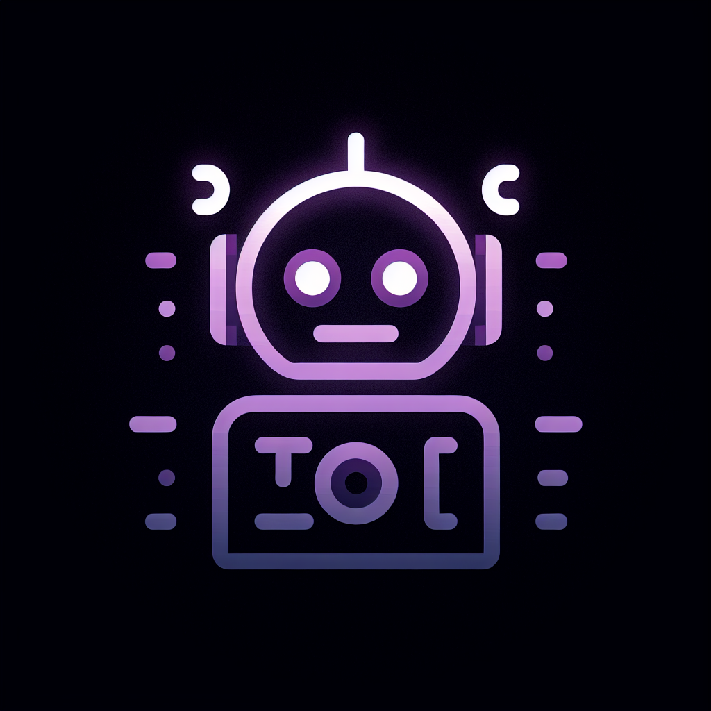

# AI-Powered Resume Scanner



## 📋 Overview

The **AI-Powered Resume Scanner** is a sophisticated web application designed to bridge the gap between job seekers and employers by automating the resume analysis process. It parses resumes, analyzes job descriptions, and calculates detailed match scores to help users understand how well their qualifications align with specific job requirements.

Leveraging advanced Natural Language Processing (NLP) and Google's Gemini AI, the system provides personalized feedback and actionable recommendations through an interactive chat interface, making the job application process more transparent and efficient.

## ✨ Features

- **Intelligent Resume Parsing**: Extract structured information from PDF, DOCX, and DOC resumes with advanced OCR capabilities for scanned documents
- **Job Description Analysis**: Identify key skills, experience requirements, and qualifications from job postings
- **AI-Powered Matching**: Calculate precise match scores using Google's Gemini AI, with fallback to traditional algorithms when needed
- **Detailed Feedback System**: Analyze skills, experience, and education matches with specific gap identification
- **Interactive Chat Interface**: Get personalized advice and answers to specific questions about your job match
- **Robust Fallback Mechanisms**: Ensures system functionality even when AI services are unavailable
- **User-Friendly Interface**: Clean, intuitive Streamlit UI with responsive design

## 🚀 Getting Started

### Prerequisites

- Python 3.10+
- Tesseract OCR installed on your system ([Installation guide](https://github.com/tesseract-ocr/tesseract))
- Google Gemini API key (for AI-powered analysis)

### Installation

1. Clone the repository:
```bash
git clone https://github.com/yourusername/ai-resume-scanner.git
cd ai-resume-scanner
```

2. Install dependencies:
```bash
pip install -r requirements.txt
```

3. Install the required spaCy model:
```bash
python -m spacy download en_core_web_sm
```

4. Set up your environment variables:
```bash
# For Linux/Mac
export GOOGLE_API_KEY='your_gemini_api_key'

# For Windows
set GOOGLE_API_KEY=your_gemini_api_key
```

### Running the Application

Launch the application with:
```bash
streamlit run app.py
```

The application will be available at http://localhost:5000 by default.

## 🧩 System Architecture

The application follows a modular architecture with the following key components:

### Core Components

1. **Resume Parser** (`resume_parser.py`)
   - Handles various document formats (PDF, DOCX, DOC)
   - Extracts text using PyMuPDF, python-docx, and OCR
   - Uses AI to extract structured information like skills, experience, and education

2. **Job Analyzer** (`job_analyzer.py`)
   - Processes job descriptions to identify requirements
   - Extracts key skills, experience levels, and educational qualifications
   - Categorizes technical and soft skills

3. **Relevance Scorer** (`relevance_scorer.py`)
   - Calculates match scores between resumes and job requirements
   - Implements vector-based similarity and keyword matching
   - Handles synonym matching for better accuracy

4. **AI Helper** (`ai_helper.py`)
   - Integrates with Google's Gemini AI
   - Provides intelligent analysis and recommendations
   - Implements fallback mechanisms for AI service failures

5. **User Interface** (`app.py`)
   - Streamlit-based web interface
   - Multi-step workflow with resume upload, job description input, and results display
   - Interactive chat capability for personalized guidance

### Data Flow

1. User uploads resume
2. System parses and extracts structured information
3. User inputs job description
4. System analyzes job requirements
5. AI calculates match scores and generates feedback
6. Results presented with interactive chat option for follow-up questions

## 📊 Match Scoring System

The match scoring algorithm evaluates three key dimensions:

1. **Skills Match (50% weight)**
   - Identifies technical and soft skills in both resume and job description
   - Uses synonym matching to account for variations in terminology
   - Calculates percentage of job-required skills found in resume

2. **Experience Match (30% weight)**
   - Evaluates years of experience against job requirements
   - Analyzes domain relevance of past positions
   - Identifies specific experience gaps

3. **Education Match (20% weight)**
   - Compares education level (high school, bachelor's, master's, etc.)
   - Evaluates relevance of field of study
   - Considers certifications and specialized training

The system provides an overall percentage score and detailed breakdown of matches and gaps in each category.

## 💬 Chat Interface

The application includes an AI-powered chat interface that allows users to:

- Ask specific questions about their match results
- Get personalized recommendations for improvement
- Understand exactly what skills or qualifications they need to add
- Receive guidance on how to tailor their resume for specific positions

## 🔧 Technical Implementation

### Resume Parsing

- Uses PyMuPDF for primary text extraction
- Implements OCR with Tesseract for scanned documents
- Enhances image quality for better text recognition
- Applies AI to extract structured information

### Job Description Analysis

- Uses NLP to identify key requirements
- Categorizes skills, experience, and educational requirements
- Supports both AI and rule-based analysis methods

### Matching Algorithm

- Implements TF-IDF vectorization for text similarity
- Uses cosine similarity for relevance calculation
- Provides fallback scoring mechanisms for reliability

## 🛠️ Technologies Used

- **Python**: Primary programming language
- **Streamlit**: Web interface framework
- **spaCy**: Natural language processing
- **scikit-learn**: Machine learning and text vectorization
- **Google Gemini AI**: Advanced language model for intelligent matching
- **PyMuPDF**: PDF processing
- **pytesseract & pdf2image**: OCR capabilities
- **python-docx**: Word document processing

## 🚦 Limitations and Future Work

### Current Limitations

- English language support only
- Limited file format support (PDF, DOCX, DOC)
- Requires internet connection for AI-powered features

### Planned Enhancements

- Multilingual support for international resumes and job descriptions
- Resume builder based on gap analysis
- Custom job suggestions based on resume content
- Company-specific insights and tailoring
- ATS integration for direct job applications
- Enhanced analytics and industry benchmarking

## 📜 License

This project is licensed under the MIT License - see the LICENSE file for details.

## 🙏 Acknowledgments

- Google Gemini AI for powering the intelligent matching
- Streamlit for the interactive web framework
- All open source libraries that made this project possible

